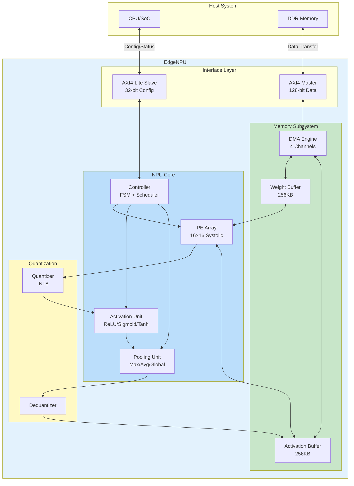
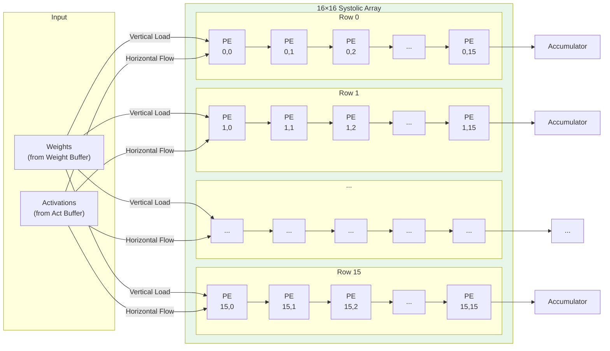
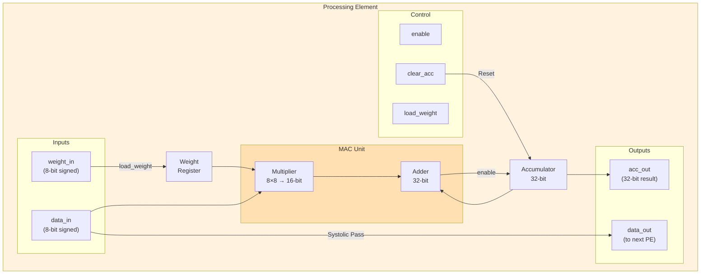
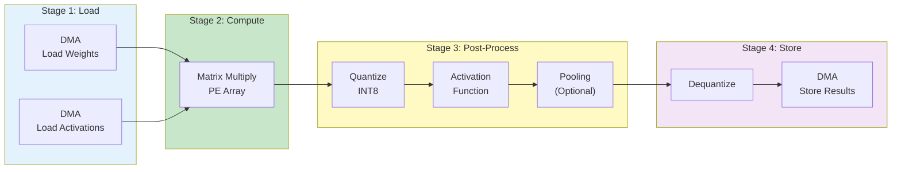
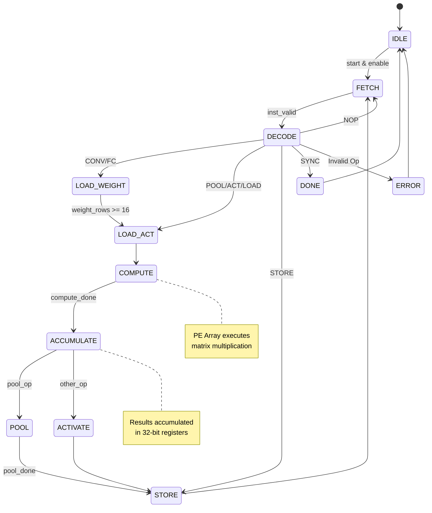
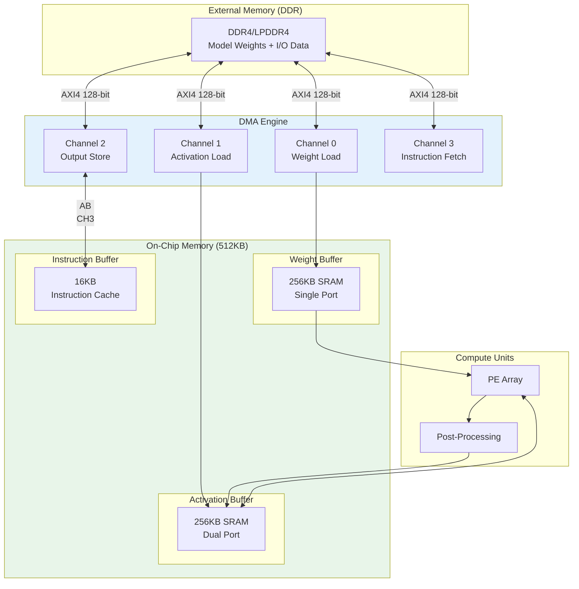
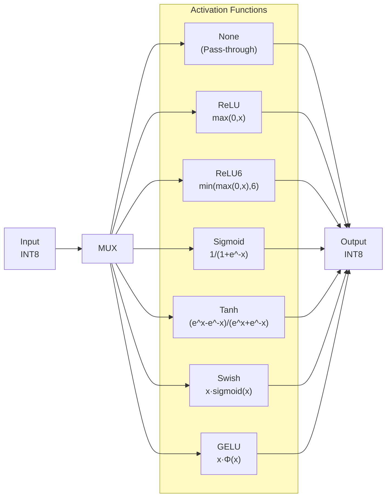
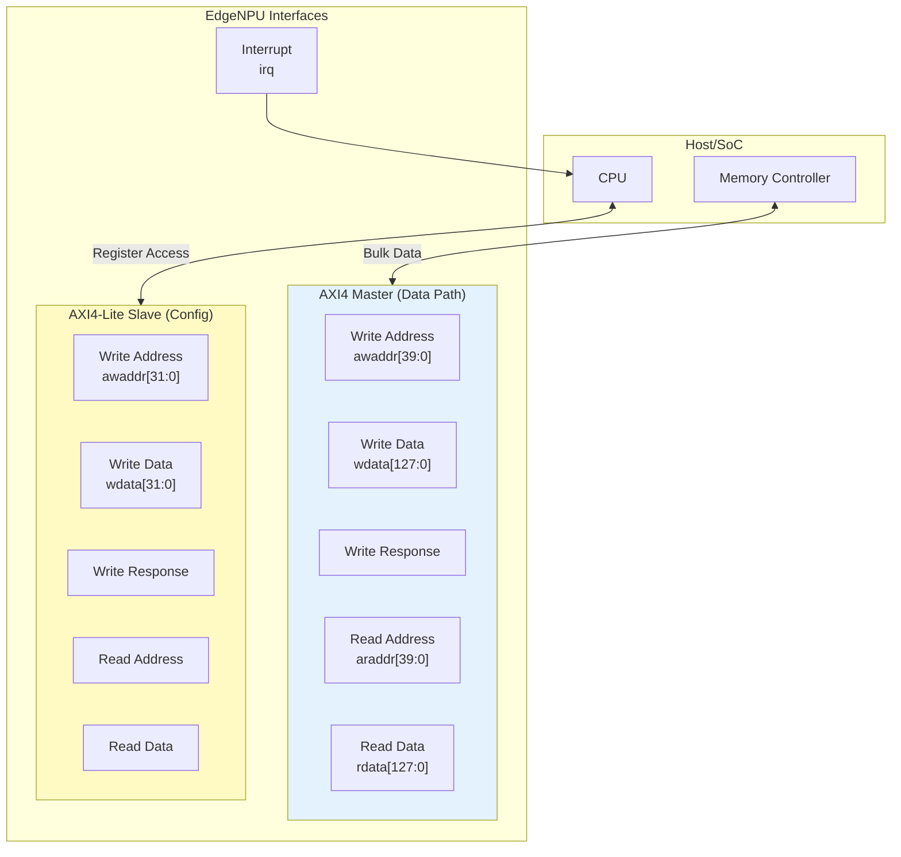
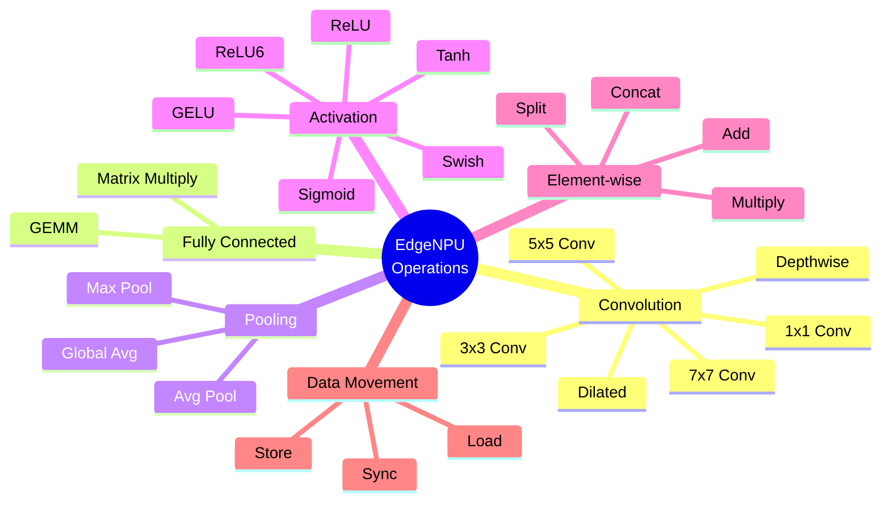

# EdgeNPU Architecture Diagrams (Mermaid)

Các diagram dưới đây có thể paste trực tiếp vào https://mermaid.live/ để render.

---

## 1. High-Level System Architecture

---

## 2. PE Array (Systolic Array) Architecture

---

## 3. Processing Element (PE) Internal Structure

---

## 4. Data Flow Pipeline

---

## 5. Controller State Machine

---

## 6. Memory Architecture

---

## 7. Activation Functions Supported

---

## 8. Quantization Pipeline

```mermaid
flowchart LR
    subgraph FP_DOMAIN["Floating Point Domain"]
        FP32["FP32 Input<br/>(from training)"]
    end
    
    subgraph QUANTIZE["Quantization"]
        SCALE1["Scale<br/>(per-channel)"]
        ZP1["Zero Point"]
        SAT1["Saturate<br/>[-128, 127]"]
    end
    
    subgraph INT_DOMAIN["Integer Domain (NPU)"]
        INT8["INT8<br/>Compute"]
        PE_COMP["PE Array<br/>MAC Operations"]
        ACC32["32-bit<br/>Accumulator"]
    end
    
    subgraph DEQUANTIZE["Dequantization"]
        ZP2["Subtract<br/>Zero Point"]
        SCALE2["Multiply<br/>Scale"]
    end
    
    subgraph OUTPUT_DOMAIN["Output"]
        OUT["Output<br/>Tensor"]
    end
    
    FP32 --> SCALE1
    SCALE1 --> ZP1
    ZP1 --> SAT1
    SAT1 --> INT8
    
    INT8 --> PE_COMP
    PE_COMP --> ACC32
    
    ACC32 --> ZP2
    ZP2 --> SCALE2
    SCALE2 --> OUT
    
    style FP_DOMAIN fill:#ffcdd2
    style INT_DOMAIN fill:#c8e6c9
    style OUTPUT_DOMAIN fill:#bbdefb
```

---

## 9. AXI Interface Architecture

---

## 10. Supported Operations

